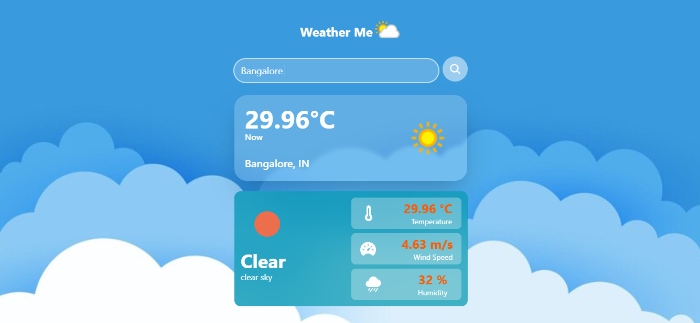

#  Weather-check App built with Django and Tailwind CSS.

1.Built with Django and Tailwind CSS – Combines powerful backend with a stylish, responsive frontend.

2.Real-time weather data – Fetches up-to-date weather information from reliable APIs.

3.Easy city search – Users can search for weather information by entering a city name.

4.Displays key weather metrics – Shows temperature, humidity, and wind speed.

5.Responsive design – Tailwind CSS ensures the app is mobile-friendly and visually appealing.

6.Backend functionality – Django handles all data processing and API integration for seamless user experience.

7.REST API integration – Uses REST API to fetch and manage weather data efficiently.
